# Product Requirements Document (PRD)

# 1. INTRODUCTION

## 1.1 Purpose

This Product Requirements Document (PRD) specifies the requirements for developing an advanced AI-powered audio system for the TALD UNIA platform. The document serves as a comprehensive reference for:

- Software development teams implementing the audio processing features
- Hardware engineers designing the physical audio components
- Quality assurance teams validating system functionality
- Project managers overseeing development milestones
- Stakeholders evaluating project progress and alignment

## 1.2 Scope

The TALD UNIA audio system encompasses a minimalist hardware foundation enhanced by sophisticated AI-driven audio processing capabilities. The system aims to deliver premium audio quality comparable to high-end systems while maintaining hardware efficiency.

Key Features:
- High-fidelity audio output through optimized DAC/amplifier and speaker system
- AI-enhanced audio processing for superior sound quality
- Spatial audio processing with head tracking
- Personalized audio profiles and adaptive sound optimization
- Voice control and microphone array integration
- Developer toolkit and APIs for audio application development

The system will integrate with the TALD UNIA operating system and provide a foundation for third-party applications requiring advanced audio capabilities. Out of scope are physical enclosure design specifications and manufacturing processes.

# 2. PRODUCT DESCRIPTION

## 2.1 Product Perspective

The TALD UNIA audio system functions as an integral subsystem within the larger TALD UNIA platform, interfacing with:

- TALD UNIA Operating System
- Third-party applications and games
- External audio devices via Bluetooth/USB
- Cloud-based AI processing services
- Voice assistant integration
- Spatial tracking sensors

The system operates as a hybrid solution combining local hardware processing with cloud-based AI enhancement:

## 2.2 Product Functions

- Real-time AI-enhanced audio processing
- Spatial audio rendering with head tracking
- Dynamic sound optimization and personalization
- Voice control and natural language processing
- Multi-channel audio mixing and routing
- Adaptive noise cancellation
- Audio profile management
- Developer API access and SDK tools
- Automatic audio calibration
- Environmental audio adaptation

## 2.3 User Characteristics

Primary user personas include:

| User Type | Characteristics | Technical Expertise | Usage Patterns |
|-----------|----------------|---------------------|----------------|
| Casual Users | General consumers using basic audio features | Low to Medium | Music, videos, calls |
| Power Users | Audio enthusiasts seeking premium sound | Medium to High | High-res audio, spatial audio |
| Developers | Third-party application creators | High | API integration, custom audio solutions |
| Content Creators | Media producers and streamers | Medium to High | Recording, mixing, streaming |

## 2.4 Constraints

Technical Constraints:
- Hardware size and power limitations
- Processing latency requirements (<10ms)
- Bluetooth/wireless bandwidth restrictions
- Local storage capacity for audio profiles
- Mobile processor capabilities

Regulatory Constraints:
- Audio volume safety regulations
- Wireless transmission standards
- Data privacy requirements
- Accessibility compliance

Business Constraints:
- Component cost targets
- Time-to-market requirements
- Third-party licensing restrictions
- Cloud processing budget limitations

## 2.5 Assumptions and Dependencies

Assumptions:
- Users have internet connectivity for cloud-based features
- Base hardware meets minimum processing requirements
- Users accept cloud processing of audio data
- Market demand for AI-enhanced audio remains strong

Dependencies:
- Cloud AI processing infrastructure availability
- Third-party AI API service levels
- Operating system audio stack compatibility
- Spatial tracking sensor accuracy
- Hardware component supply chain
- Regulatory approval timelines
- Partner integration schedules

# 3. PROCESS FLOWCHART

# 4. FUNCTIONAL REQUIREMENTS

## 4.1 Audio Processing Core

### ID: F1
### Description
Core audio processing system handling digital signal processing, conversion, and amplification
### Priority: Critical
### Requirements

| ID | Requirement | Priority | Notes |
|----|-------------|----------|--------|
| F1.1 | High-fidelity DAC with 32-bit/384kHz support | Critical | Maximum 0.0005% THD+N |
| F1.2 | Class-D amplifier with 90% efficiency | Critical | 25W per channel |
| F1.3 | Digital signal processing with <5ms latency | Critical | Local processing |
| F1.4 | Multi-channel audio routing matrix | High | Up to 8 channels |
| F1.5 | Hardware volume control with 0.5dB steps | Medium | -90dB to +10dB range |

## 4.2 AI Enhancement Engine

### ID: F2
### Description
AI-powered audio processing features for sound optimization and enhancement
### Priority: Critical
### Requirements

| ID | Requirement | Priority | Notes |
|----|-------------|----------|--------|
| F2.1 | Real-time AI upsampling | High | Up to 4x sample rate |
| F2.2 | Dynamic range optimization | Critical | Automatic compression |
| F2.3 | AI noise reduction | High | -20dB noise floor |
| F2.4 | Neural audio rendering | Medium | Cloud-assisted |
| F2.5 | Adaptive EQ with AI learning | High | 20-band processing |

## 4.3 Spatial Audio System

### ID: F3
### Description
3D audio processing with head tracking and spatial rendering
### Priority: High
### Requirements

| ID | Requirement | Priority | Notes |
|----|-------------|----------|--------|
| F3.1 | Head tracking with 6DoF | High | <20ms latency |
| F3.2 | Binaural audio processing | Critical | HRTF support |
| F3.3 | Room acoustics modeling | Medium | Real-time adaptation |
| F3.4 | Object-based audio rendering | High | Up to 128 objects |
| F3.5 | Spatial audio calibration | Medium | Automatic setup |

## 4.4 Voice Processing

### ID: F4
### Description
Microphone array and voice processing capabilities
### Priority: High
### Requirements

| ID | Requirement | Priority | Notes |
|----|-------------|----------|--------|
| F4.1 | 4-mic array with beamforming | Critical | 180° coverage |
| F4.2 | Voice activity detection | High | 98% accuracy |
| F4.3 | Echo cancellation | Critical | -40dB suppression |
| F4.4 | Voice command processing | High | Local recognition |
| F4.5 | Background noise suppression | High | Adaptive threshold |

## 4.5 Developer Tools

### ID: F5
### Description
API and SDK for third-party audio development
### Priority: Medium
### Requirements

| ID | Requirement | Priority | Notes |
|----|-------------|----------|--------|
| F5.1 | Audio processing API | High | C++/Python support |
| F5.2 | Spatial audio SDK | Medium | Unity/Unreal plugins |
| F5.3 | Voice integration toolkit | Medium | REST API access |
| F5.4 | Audio profiling tools | Low | Performance analysis |
| F5.5 | Sample code and documentation | Medium | Online repository |

## 4.6 User Profiles

### ID: F6
### Description
Personalized audio settings and profile management
### Priority: Medium
### Requirements

| ID | Requirement | Priority | Notes |
|----|-------------|----------|--------|
| F6.1 | Multiple user profiles | High | Cloud sync support |
| F6.2 | Automatic profile switching | Medium | User detection |
| F6.3 | Listening history analysis | Low | AI optimization |
| F6.4 | Custom EQ presets | Medium | 10 slots per user |
| F6.5 | Profile export/import | Low | Standard format |

# 5. NON-FUNCTIONAL REQUIREMENTS

## 5.1 Performance Requirements

| Metric | Requirement | Target |
|--------|-------------|---------|
| Audio Latency | End-to-end processing time | <10ms local, <50ms cloud |
| CPU Usage | Maximum processor utilization | <15% at idle, <40% peak |
| Memory Usage | RAM consumption | <256MB base, <1GB peak |
| Network Bandwidth | Cloud AI processing | <2Mbps average, <10Mbps peak |
| Battery Impact | Power consumption | <5% of total device power |
| Storage | Local audio cache | <2GB maximum |
| Concurrent Users | Simultaneous audio streams | Up to 8 streams |
| AI Processing | Real-time enhancement | <2ms per frame |

## 5.2 Safety Requirements

| Category | Requirement | Implementation |
|----------|-------------|----------------|
| Volume Protection | Maximum output limiting | 100dB SPL limit with soft clipping |
| Thermal Management | Temperature monitoring | Auto-shutdown at 85°C |
| Error Recovery | Graceful degradation | Fallback to basic audio processing |
| Hardware Protection | Circuit protection | Over-current and voltage protection |
| User Warnings | Health notifications | Exposure time warnings |
| Emergency Override | System muting | Instant mute on emergency signals |

## 5.3 Security Requirements

| Feature | Requirement | Details |
|---------|-------------|----------|
| Authentication | User verification | OAuth 2.0 integration |
| Data Encryption | Audio stream security | AES-256 encryption |
| Privacy Controls | User data protection | GDPR/CCPA compliance |
| Access Control | API security | JWT-based authorization |
| Secure Storage | Profile data protection | Encrypted local storage |
| Audit Logging | Security monitoring | Activity and access logs |
| Update Security | Firmware protection | Signed updates only |

## 5.4 Quality Requirements

### 5.4.1 Availability
- System uptime: 99.99%
- Planned maintenance: <4 hours/month
- Recovery time: <5 minutes
- Redundancy: Hot-swap capability for critical components

### 5.4.2 Maintainability
- MTTR (Mean Time To Repair): <2 hours
- Modular architecture for easy updates
- Self-diagnostic capabilities
- Remote maintenance support

### 5.4.3 Usability
- Initial setup time: <5 minutes
- Learning curve: <30 minutes for basic features
- Error rate: <1% for common operations
- Accessibility: WCAG 2.1 AA compliance

### 5.4.4 Scalability
- Vertical scaling: Support for additional processing cores
- Horizontal scaling: Cloud processing distribution
- Storage scaling: Dynamic cloud storage allocation
- Feature scaling: Modular feature activation

### 5.4.5 Reliability
- MTBF (Mean Time Between Failures): >50,000 hours
- Error rate: <0.1% for audio processing
- Data integrity: 99.999% for user profiles
- Backup frequency: Real-time cloud sync

## 5.5 Compliance Requirements

| Standard | Requirement | Scope |
|----------|-------------|--------|
| Audio Safety | EN 50332-1:2013 | Volume limiting |
| EMC | FCC Part 15, CE | Electromagnetic compatibility |
| Wireless | Bluetooth SIG, Wi-Fi Alliance | Wireless certification |
| Privacy | GDPR, CCPA, PIPEDA | Data protection |
| Accessibility | ADA, EN 301 549 | Interface standards |
| Environmental | RoHS, WEEE | Material compliance |
| Quality | ISO 9001:2015 | Quality management |
| Security | ISO 27001 | Information security |

# 6. DATA REQUIREMENTS

## 6.1 Data Models

### 6.1.1 Core Audio Data Model

```mermaid
erDiagram
    User ||--o{ AudioProfile : has
    AudioProfile ||--o{ EQPreset : contains
    AudioProfile ||--o{ SpatialSettings : contains
    AudioProfile ||--o{ ListeningHistory : contains
    
    User {
        string userId
        string username
        timestamp created_at
        string preferences
    }
    
    AudioProfile {
        string profileId
        string userId
        string name
        json settings
        timestamp last_modified
    }
    
    EQPreset {
        string presetId
        string profileId
        string name
        json eqBands
        boolean isActive
    }
    
    SpatialSettings {
        string settingId
        string profileId
        float headSize
        json hrtfData
        json roomAcoustics
    }
    
    ListeningHistory {
        string historyId
        string profileId
        timestamp timestamp
        string audioType
        json parameters
    }
```

### 6.1.2 AI Processing Data Model

## 6.2 Data Storage

### 6.2.1 Local Storage Requirements
- User profiles: 100MB per user
- Audio cache: 2GB maximum
- AI model cache: 500MB
- System logs: 200MB rotating storage
- Configuration data: 50MB

### 6.2.2 Cloud Storage Requirements
- User profiles backup: Unlimited with quota per user
- AI training data: Petabyte-scale object storage
- Analytics data: Time-series database storage
- Audit logs: 1 year retention minimum

### 6.2.3 Data Redundancy
- Local data: RAID 1 configuration for critical data
- Cloud data: Geographic replication across 3 regions
- Real-time synchronization between local and cloud
- Daily incremental backups
- Weekly full backups
- 30-day backup retention

## 6.3 Data Processing

### 6.3.1 Data Flow

### 6.3.2 Data Security
- Encryption at rest: AES-256
- Encryption in transit: TLS 1.3
- Key management: HSM-based
- Access control: Role-based (RBAC)
- Data anonymization for AI training
- Secure audio buffer management
- Zero-trust architecture for cloud processing

### 6.3.3 Processing Requirements
- Real-time processing: <2ms latency
- Batch processing: Daily aggregation
- Stream processing: 10,000 events/second
- AI inference: 100 operations/second
- Data compression: Lossless for critical audio
- Cache hit ratio: >95%

### 6.3.4 Data Retention
- User data: As long as account active
- System logs: 90 days
- Performance metrics: 1 year
- AI training data: 2 years
- Audio cache: 24 hours
- Analytics data: 5 years

# 7. EXTERNAL INTERFACES

## 7.1 User Interfaces

### 7.1.1 Audio Control Panel

- Minimalist design with touch-optimized controls
- Dark mode and light mode support
- Responsive layout scaling from 320px to 4K
- Real-time visualization of audio processing
- Gesture support for common audio controls

### 7.1.2 Developer Console

- API documentation browser
- Real-time audio debugging tools
- Performance monitoring dashboard
- Configuration management interface
- Log viewer and analysis tools

## 7.2 Hardware Interfaces

### 7.2.1 Audio Output Interfaces

| Interface | Specification | Protocol |
|-----------|--------------|-----------|
| DAC | 32-bit/384kHz ESS ES9038PRO | I2S |
| Amplifier | Class-D 25W/channel | I2C control |
| Speaker Out | 4-8Ω impedance | Analog |
| Headphone | 32-600Ω support | Analog |
| HDMI | eARC support | HDMI 2.1 |
| USB-C | Audio class 2.0 | USB 3.2 |

### 7.2.2 Audio Input Interfaces

| Interface | Specification | Protocol |
|-----------|--------------|-----------|
| Mic Array | 4x MEMS digital | PDM |
| Line In | 24-bit ADC | I2S |
| Bluetooth | aptX HD/LDAC | Bluetooth 5.2 |
| USB Host | UAC2 support | USB 3.2 |

### 7.2.3 Sensor Interfaces

| Sensor | Interface | Purpose |
|--------|-----------|---------|
| IMU | SPI | Head tracking |
| Temperature | I2C | Thermal monitoring |
| Proximity | I2C | User detection |
| Ambient Light | I2C | Display adaptation |

## 7.3 Software Interfaces

### 7.3.1 Operating System Integration

### 7.3.2 API Services

| Service | Protocol | Authentication |
|---------|----------|----------------|
| Audio Processing API | REST/WebSocket | OAuth 2.0 |
| AI Enhancement API | gRPC | JWT |
| Spatial Audio API | WebRTC | API Key |
| Profile Sync API | REST | OAuth 2.0 |
| Analytics API | GraphQL | API Key |

### 7.3.3 Third-party Integration

- Unity Audio Plugin
- Unreal Engine Integration
- VST3 Plugin Support
- ASIO Driver Support
- Core Audio Support

## 7.4 Communication Interfaces

### 7.4.1 Network Protocols

| Protocol | Usage | Security |
|----------|--------|----------|
| TCP/IP | Control data | TLS 1.3 |
| UDP | Real-time audio | DTLS 1.2 |
| WebSocket | Stream control | WSS |
| Bluetooth A2DP | Wireless audio | AES-256 |
| MQTT | Device status | TLS 1.3 |

### 7.4.2 Data Formats

| Format | Purpose | Encoding |
|--------|---------|----------|
| PCM | Raw audio | 16/24/32-bit |
| FLAC | Lossless compression | Level 8 |
| AAC | Lossy compression | 256kbps VBR |
| JSON | Control messages | UTF-8 |
| Protobuf | AI data | Binary |

### 7.4.3 Cloud Communication

- AWS Direct Connect support
- Google Cloud Interconnect
- Azure ExpressRoute
- Private 5G network option
- Edge computing nodes

# 8. APPENDICES

## 8.1 GLOSSARY

| Term | Definition |
|------|------------|
| Binaural Audio | Audio recorded or processed to create a 3D stereo sound sensation for the listener |
| Class-D Amplifier | A highly efficient switching amplifier design used for audio amplification |
| HRTF | Head-Related Transfer Function - describes how the ear receives sound from a point in space |
| Neural Audio Rendering | AI-based technique for generating or modifying audio using neural networks |
| Spatial Audio | Three-dimensional audio that creates an immersive sound experience |
| THD+N | Total Harmonic Distortion plus Noise - a measurement of audio signal accuracy |
| Upsampling | Process of increasing audio sample rate using interpolation techniques |
| VBR | Variable Bit Rate - audio encoding that adjusts quality based on content complexity |

## 8.2 ACRONYMS

| Acronym | Full Form |
|---------|-----------|
| ADC | Analog-to-Digital Converter |
| DAC | Digital-to-Analog Converter |
| DoF | Degrees of Freedom |
| DSP | Digital Signal Processing |
| EQ | Equalizer |
| HAL | Hardware Abstraction Layer |
| IMU | Inertial Measurement Unit |
| MEMS | Micro-Electro-Mechanical Systems |
| MTBF | Mean Time Between Failures |
| MTTR | Mean Time To Repair |
| PDM | Pulse-Density Modulation |
| RAID | Redundant Array of Independent Disks |
| SPL | Sound Pressure Level |
| UAC | USB Audio Class |

## 8.3 ADDITIONAL REFERENCES

| Reference | Description | URL |
|-----------|-------------|-----|
| Audio Engineering Society Standards | Technical standards for digital audio | www.aes.org/standards |
| Bluetooth Audio Specifications | Official Bluetooth audio codec documentation | www.bluetooth.com/specifications |
| USB Audio Device Class Specification | USB-IF audio device specifications | www.usb.org/documents |
| WebRTC Audio Processing | Google's WebRTC audio processing documentation | webrtc.org/documentation/audio |
| AI Audio Processing Research | Latest research papers on AI audio enhancement | arxiv.org/audio |
| Spatial Audio Standards | Industry standards for spatial audio implementation | www.itu.int/rec/R-BS |

## 8.4 REVISION HISTORY

| Version | Date | Author | Changes |
|---------|------|--------|---------|
| 1.0 | Initial | - | Initial document creation |
| 1.1 | - | - | Added AI processing requirements |
| 1.2 | - | - | Updated data models |
| 1.3 | - | - | Added interface specifications |
| 1.4 | - | - | Expanded compliance requirements |

## 8.5 TESTING CONSIDERATIONS

| Test Category | Tools | Metrics |
|--------------|-------|---------|
| Audio Quality | Audio Precision APx555 | THD+N, SNR, Frequency Response |
| Latency Testing | ASIO-based tools | End-to-end latency measurement |
| AI Performance | TensorFlow Profiler | Inference time, model accuracy |
| Spatial Audio | Head tracking validation suite | Tracking accuracy, response time |
| Stress Testing | Audio load generator | System stability under load |