# Technical Specifications

# 1. INTRODUCTION

## 1.1 Executive Summary

The TALD UNIA Audio System represents a revolutionary approach to audio processing that combines minimalist hardware with advanced AI capabilities to deliver premium sound quality. This system addresses the critical challenge of achieving high-end audio performance while maintaining hardware efficiency and cost-effectiveness. By leveraging AI-driven audio enhancement and spatial processing, the system targets audiophiles, gamers, content creators, and developers who demand superior sound quality without complex hardware setups.

The solution will establish new benchmarks in the industry by delivering Burmester-level audio quality through innovative AI processing, positioning TALD UNIA as a technology leader in the premium audio segment while maintaining competitive hardware costs.

## 1.2 System Overview

### Project Context

| Aspect | Description |
|--------|-------------|
| Market Position | Premium audio solution competing with high-end manufacturers |
| Target Segment | High-performance consumer electronics market |
| Competitive Edge | AI-enhanced audio processing with minimal hardware footprint |
| Integration Points | TALD UNIA OS, third-party applications, cloud services |

### High-Level Description

The system architecture combines:
- Precision-engineered DAC/amplifier hardware core
- Multi-layer AI processing pipeline for audio enhancement
- Spatial audio processing with head tracking
- Cloud-based processing for advanced features
- Developer SDK for third-party integration

### Success Criteria

| Metric | Target |
|--------|--------|
| Audio Quality | THD+N < 0.0005% |
| Processing Latency | < 10ms end-to-end |
| AI Enhancement | 20% improvement in perceived audio quality |
| Power Efficiency | 90% amplifier efficiency |
| Market Reception | 85% user satisfaction rating |

## 1.3 Scope

### In-Scope Elements

Core Features:
- High-fidelity audio processing pipeline
- AI-driven audio enhancement
- Spatial audio with head tracking
- Voice processing and control
- Developer API and SDK
- User profile management

Implementation Coverage:
- Hardware audio components
- Software processing stack
- Cloud processing integration
- Third-party development support
- Quality assurance framework

### Out-of-Scope Elements

- Physical enclosure design
- Manufacturing processes
- Retail distribution
- Legacy system migration
- Custom hardware manufacturing
- Non-audio related features
- External device management
- Physical installation services

# 2. SYSTEM ARCHITECTURE

## 2.1 High-Level Architecture

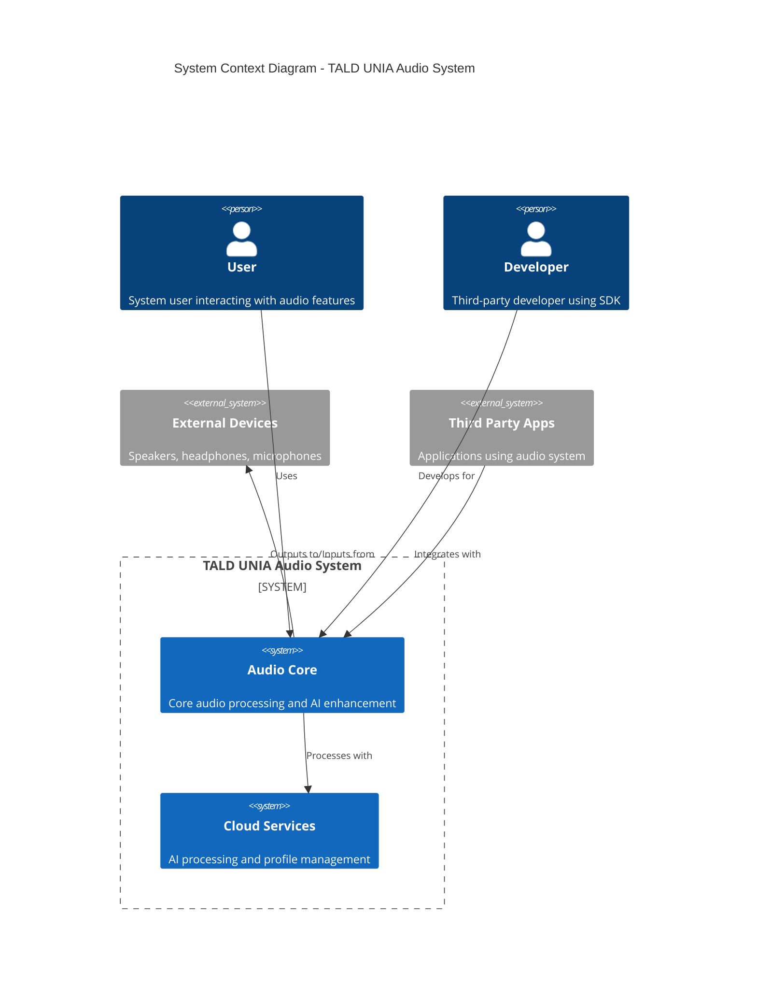
```mermaid
C4Context
    title System Context Diagram - TALD UNIA Audio System

    Person(user, "User", "System user interacting with audio features")
    Person(developer, "Developer", "Third-party developer using SDK")
    
    System_Boundary(audio_system, "TALD UNIA Audio System") {
        System(core, "Audio Core", "Core audio processing and AI enhancement")
        System(cloud, "Cloud Services", "AI processing and profile management")
    }
    
    System_Ext(ext_devices, "External Devices", "Speakers, headphones, microphones")
    System_Ext(third_party, "Third Party Apps", "Applications using audio system")
    
    Rel(user, core, "Uses")
    Rel(developer, core, "Develops for")
    Rel(core, cloud, "Processes with")
    Rel(core, ext_devices, "Outputs to/Inputs from")
    Rel(third_party, core, "Integrates with")
```

## 2.2 Component Details

### 2.2.1 Container Architecture

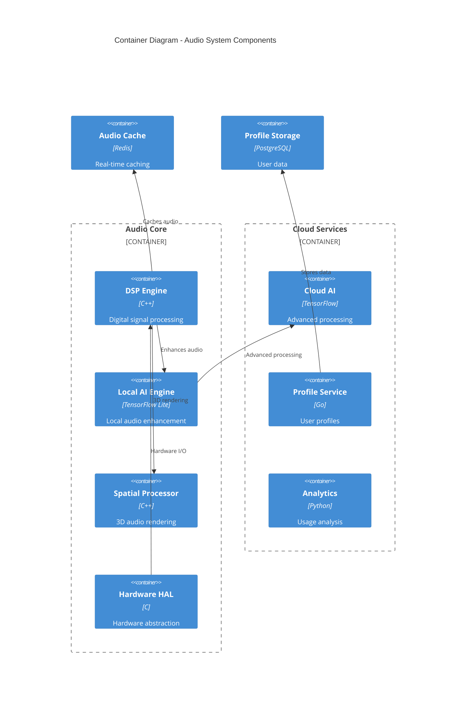
```mermaid
C4Container
    title Container Diagram - Audio System Components

    Container_Boundary(audio_core, "Audio Core") {
        Container(dsp, "DSP Engine", "C++", "Digital signal processing")
        Container(ai_local, "Local AI Engine", "TensorFlow Lite", "Local audio enhancement")
        Container(spatial, "Spatial Processor", "C++", "3D audio rendering")
        Container(hal, "Hardware HAL", "C", "Hardware abstraction")
    }

    Container_Boundary(cloud_services, "Cloud Services") {
        Container(ai_cloud, "Cloud AI", "TensorFlow", "Advanced processing")
        Container(profiles, "Profile Service", "Go", "User profiles")
        Container(analytics, "Analytics", "Python", "Usage analysis")
    }

    Container(cache, "Audio Cache", "Redis", "Real-time caching")
    Container(storage, "Profile Storage", "PostgreSQL", "User data")

    Rel(dsp, ai_local, "Enhances audio")
    Rel(dsp, spatial, "3D rendering")
    Rel(hal, dsp, "Hardware I/O")
    Rel(ai_local, ai_cloud, "Advanced processing")
    Rel(profiles, storage, "Stores data")
    Rel(dsp, cache, "Caches audio")
```

### 2.2.2 Component Specifications

| Component | Technology | Purpose | Scaling Strategy |
|-----------|------------|---------|------------------|
| DSP Engine | C++/SIMD | Core audio processing | Vertical scaling |
| Local AI | TensorFlow Lite | Real-time enhancement | GPU acceleration |
| Spatial Processor | C++/CUDA | 3D audio rendering | GPU scaling |
| Cloud AI | TensorFlow | Advanced processing | Horizontal scaling |
| Profile Service | Go | User management | Container orchestration |
| Analytics | Python | System monitoring | Distributed processing |

## 2.3 Technical Decisions

### 2.3.1 Architecture Patterns

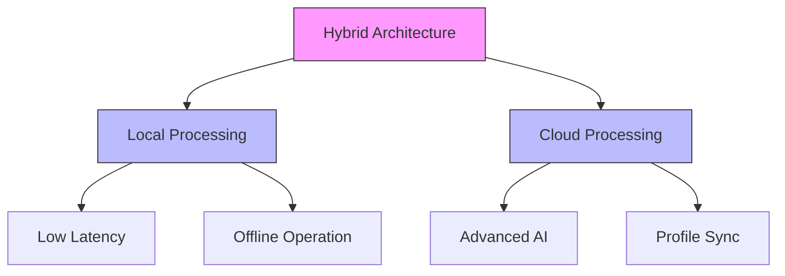
```mermaid
graph TD
    A[Hybrid Architecture] --> B[Local Processing]
    A --> C[Cloud Processing]
    
    B --> D[Low Latency]
    B --> E[Offline Operation]
    
    C --> F[Advanced AI]
    C --> G[Profile Sync]
    
    style A fill:#f9f,stroke:#333
    style B fill:#bbf,stroke:#333
    style C fill:#bbf,stroke:#333
```

### 2.3.2 Communication Patterns

| Pattern | Use Case | Protocol |
|---------|----------|----------|
| Synchronous | Real-time audio | gRPC |
| Asynchronous | Profile updates | Message Queue |
| Event-driven | State changes | WebSocket |
| Streaming | Audio processing | RTP/RTCP |

## 2.4 Cross-Cutting Concerns

### 2.4.1 System Monitoring

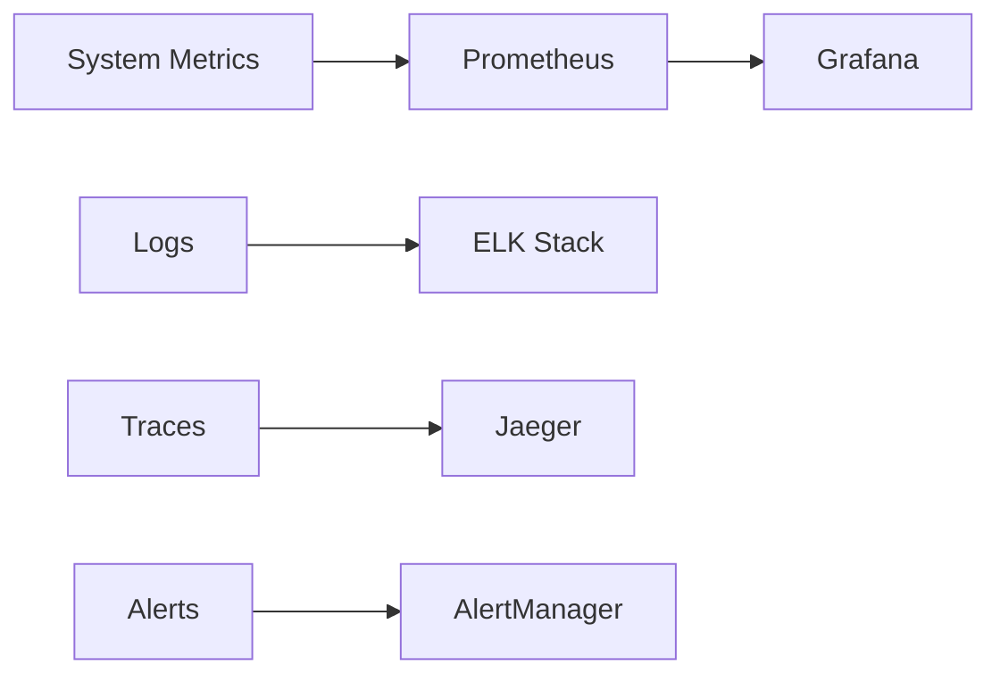
```mermaid
graph LR
    A[System Metrics] --> B[Prometheus]
    B --> C[Grafana]
    
    D[Logs] --> E[ELK Stack]
    
    F[Traces] --> G[Jaeger]
    
    H[Alerts] --> I[AlertManager]
```

### 2.4.2 Data Flow Architecture

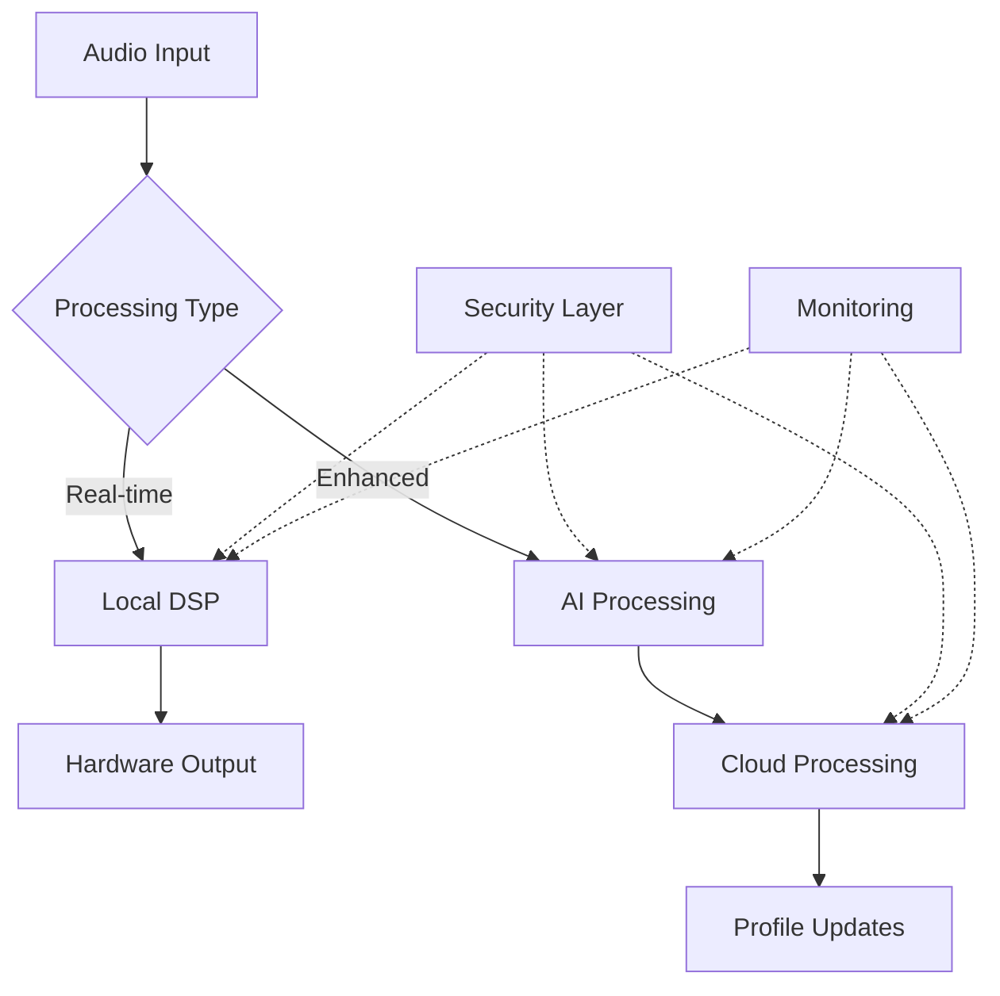
```mermaid
flowchart TD
    A[Audio Input] --> B{Processing Type}
    B -->|Real-time| C[Local DSP]
    B -->|Enhanced| D[AI Processing]
    
    C --> E[Hardware Output]
    D --> F[Cloud Processing]
    F --> G[Profile Updates]
    
    H[Security Layer] -.-> C
    H -.-> D
    H -.-> F
    
    I[Monitoring] -.-> C
    I -.-> D
    I -.-> F
```

## 2.5 Deployment Architecture

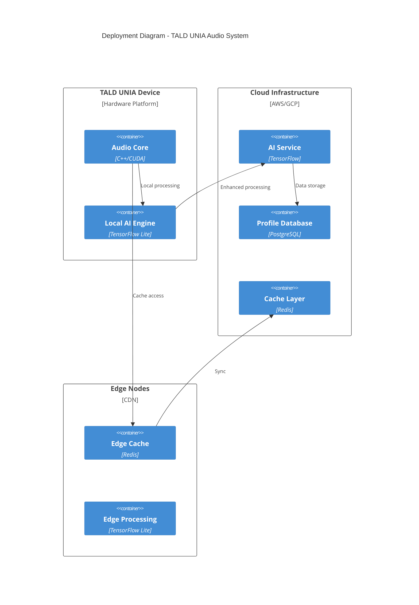
```mermaid
C4Deployment
    title Deployment Diagram - TALD UNIA Audio System

    Deployment_Node(device, "TALD UNIA Device", "Hardware Platform") {
        Container(core_audio, "Audio Core", "C++/CUDA")
        Container(local_ai, "Local AI Engine", "TensorFlow Lite")
    }

    Deployment_Node(cloud, "Cloud Infrastructure", "AWS/GCP") {
        Container(ai_service, "AI Service", "TensorFlow")
        Container(profile_db, "Profile Database", "PostgreSQL")
        Container(cache_layer, "Cache Layer", "Redis")
    }

    Deployment_Node(edge, "Edge Nodes", "CDN") {
        Container(edge_cache, "Edge Cache", "Redis")
        Container(edge_processing, "Edge Processing", "TensorFlow Lite")
    }

    Rel(core_audio, local_ai, "Local processing")
    Rel(local_ai, ai_service, "Enhanced processing")
    Rel(ai_service, profile_db, "Data storage")
    Rel(core_audio, edge_cache, "Cache access")
    Rel(edge_cache, cache_layer, "Sync")
```

# 3. SYSTEM COMPONENTS ARCHITECTURE

## 3.1 User Interface Design

### 3.1.1 Design System Specifications

| Component | Specification | Implementation |
|-----------|--------------|----------------|
| Typography | SF Pro/Roboto | Variable font scaling |
| Color Palette | P3 color space | Adaptive contrast |
| Grid System | 8px baseline | Fluid responsive |
| Spacing | 4/8/16/24/32/48px | Consistent rhythm |
| Iconography | Custom icon set | SVG with fallbacks |
| Motion | 200-300ms easing | Reduced motion support |
| Shadows | 3-level system | Context-based depth |

### 3.1.2 Interface Components

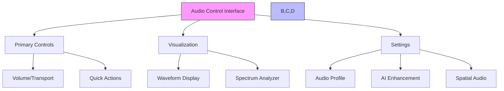
```mermaid
graph TD
    A[Audio Control Interface] --> B[Primary Controls]
    A --> C[Visualization]
    A --> D[Settings]
    
    B --> E[Volume/Transport]
    B --> F[Quick Actions]
    
    C --> G[Waveform Display]
    C --> H[Spectrum Analyzer]
    
    D --> I[Audio Profile]
    D --> J[AI Enhancement]
    D --> K[Spatial Audio]
    
    style A fill:#f9f,stroke:#333
    style B,C,D fill:#bbf,stroke:#333
```

### 3.1.3 Accessibility Requirements

| Requirement | Standard | Implementation |
|-------------|----------|----------------|
| Color Contrast | WCAG 2.1 AA | 4.5:1 minimum |
| Keyboard Navigation | Full Support | Focus indicators |
| Screen Reader | ARIA Labels | Semantic HTML |
| Touch Targets | 44x44px minimum | Adaptive sizing |
| Motion Control | Respects prefers-reduced-motion | Alternative transitions |
| Text Scaling | 200% support | Fluid typography |

## 3.2 Database Architecture

### 3.2.1 Schema Design

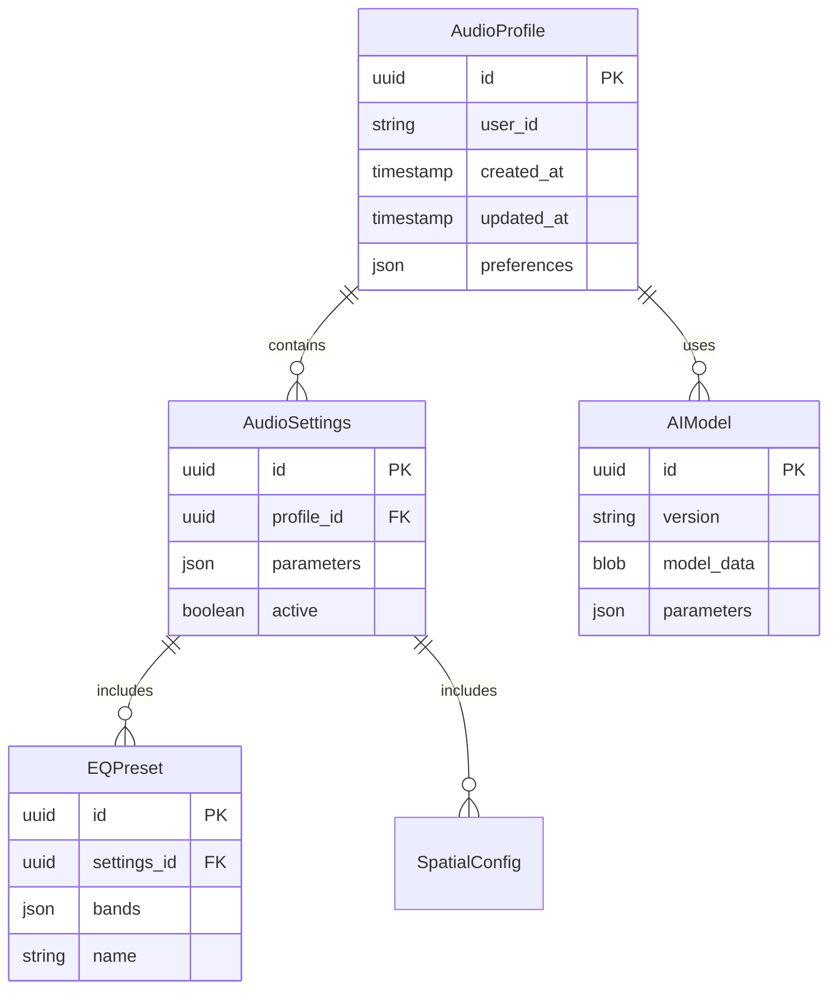
```mermaid
erDiagram
    AudioProfile ||--o{ AudioSettings : contains
    AudioProfile ||--o{ AIModel : uses
    AudioSettings ||--o{ EQPreset : includes
    AudioSettings ||--o{ SpatialConfig : includes
    
    AudioProfile {
        uuid id PK
        string user_id
        timestamp created_at
        timestamp updated_at
        json preferences
    }
    
    AudioSettings {
        uuid id PK
        uuid profile_id FK
        json parameters
        boolean active
    }
    
    AIModel {
        uuid id PK
        string version
        blob model_data
        json parameters
    }
    
    EQPreset {
        uuid id PK
        uuid settings_id FK
        json bands
        string name
    }
```

### 3.2.2 Data Management Strategy

| Aspect | Strategy | Implementation |
|--------|----------|----------------|
| Partitioning | Time-based | Monthly partitions |
| Indexing | Composite + B-tree | Profile, timestamp keys |
| Caching | Multi-level | Redis + local memory |
| Replication | Multi-region | Active-active setup |
| Backup | Incremental | 15-minute snapshots |
| Recovery | Point-in-time | 30-day retention |

## 3.3 API Architecture

### 3.3.1 API Specifications

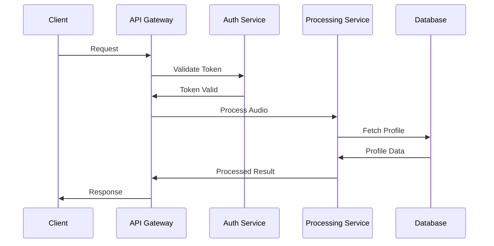
```mermaid
sequenceDiagram
    participant C as Client
    participant G as API Gateway
    participant A as Auth Service
    participant P as Processing Service
    participant D as Database
    
    C->>G: Request
    G->>A: Validate Token
    A->>G: Token Valid
    G->>P: Process Audio
    P->>D: Fetch Profile
    D->>P: Profile Data
    P->>G: Processed Result
    G->>C: Response
```

### 3.3.2 Endpoint Structure

| Endpoint | Method | Purpose | Authentication |
|----------|--------|---------|----------------|
| /api/v1/audio/process | POST | Real-time processing | JWT |
| /api/v1/profiles | GET/POST | Profile management | OAuth 2.0 |
| /api/v1/settings | PUT | Update settings | JWT |
| /api/v1/models | GET | AI model access | API Key |
| /api/v1/spatial | POST | Spatial processing | JWT |

### 3.3.3 Integration Patterns

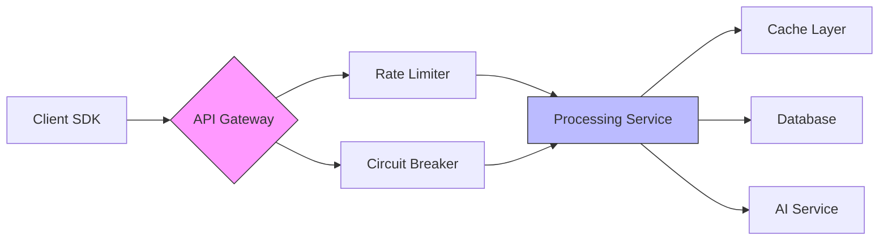
```mermaid
graph LR
    A[Client SDK] --> B{API Gateway}
    B --> C[Rate Limiter]
    B --> D[Circuit Breaker]
    
    C --> E[Processing Service]
    D --> E
    
    E --> F[Cache Layer]
    E --> G[Database]
    E --> H[AI Service]
    
    style B fill:#f9f,stroke:#333
    style E fill:#bbf,stroke:#333
```

### 3.3.4 Security Controls

| Control | Implementation | Standard |
|---------|----------------|----------|
| Authentication | OAuth 2.0 + JWT | RFC 6749 |
| Authorization | RBAC | NIST RBAC |
| Encryption | TLS 1.3 | RFC 8446 |
| Rate Limiting | Token bucket | 1000 req/min |
| Input Validation | JSON Schema | Draft 2020-12 |
| Audit Logging | Structured logs | RFC 5424 |

# 4. TECHNOLOGY STACK

## 4.1 PROGRAMMING LANGUAGES

| Platform/Component | Language | Version | Justification |
|-------------------|----------|---------|---------------|
| Audio Core | C++ | 20 | Low-level hardware access, real-time performance |
| DSP Engine | C/C++ | 20 | Optimized signal processing, SIMD support |
| AI Processing | Python | 3.11 | ML framework compatibility, rapid development |
| Hardware HAL | C | 17 | Direct hardware interfacing |
| Cloud Services | Go | 1.21 | High concurrency, efficient resource usage |
| Mobile SDK | Kotlin/Swift | Latest | Native platform integration |
| Web Interface | TypeScript | 5.0 | Type safety, developer productivity |

## 4.2 FRAMEWORKS & LIBRARIES

### Core Processing Stack

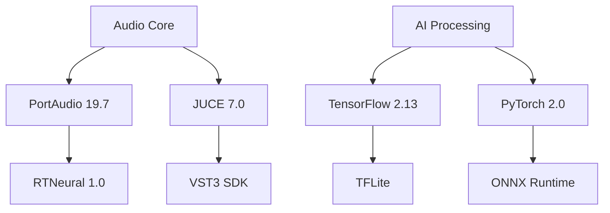
```mermaid
graph TD
    A[Audio Core] --> B[PortAudio 19.7]
    A --> C[JUCE 7.0]
    B --> D[RTNeural 1.0]
    C --> E[VST3 SDK]
    
    F[AI Processing] --> G[TensorFlow 2.13]
    F --> H[PyTorch 2.0]
    G --> I[TFLite]
    H --> J[ONNX Runtime]
```

### Framework Selection

| Component | Framework | Version | Purpose |
|-----------|-----------|---------|----------|
| Audio Processing | JUCE | 7.0 | Cross-platform audio framework |
| DSP | RTNeural | 1.0 | Real-time neural processing |
| AI Core | TensorFlow | 2.13 | Primary ML framework |
| AI Inference | TensorFlow Lite | 2.13 | Optimized edge inference |
| Spatial Audio | Steam Audio | 4.0 | 3D audio processing |
| API Layer | gRPC | 1.54 | High-performance RPC |
| Web Interface | React | 18.2 | UI component framework |

## 4.3 DATABASES & STORAGE

### Data Architecture

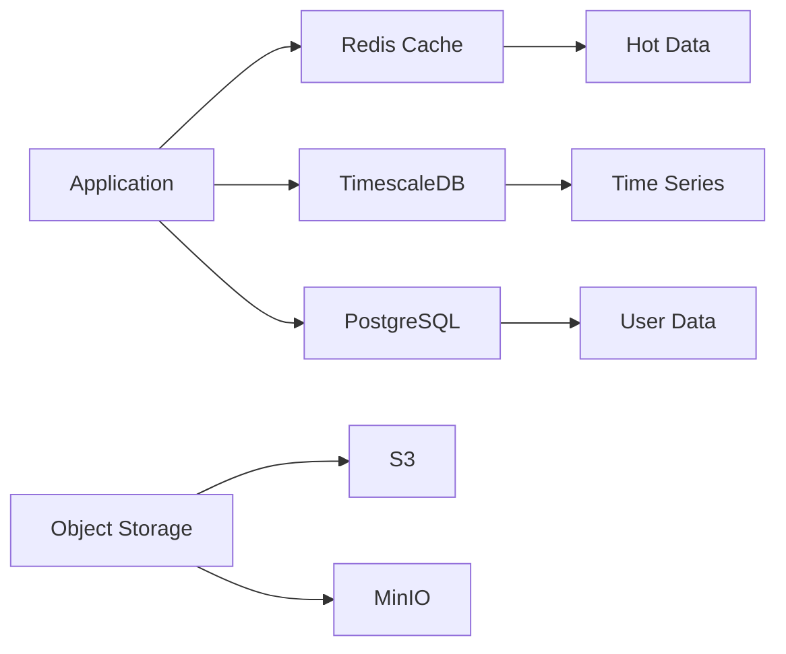
```mermaid
graph LR
    A[Application] --> B[Redis Cache]
    A --> C[TimescaleDB]
    A --> D[PostgreSQL]
    
    B --> E[Hot Data]
    C --> F[Time Series]
    D --> G[User Data]
    
    H[Object Storage] --> I[S3]
    H --> J[MinIO]
```

### Storage Solutions

| Type | Technology | Version | Use Case |
|------|------------|---------|----------|
| Primary DB | PostgreSQL | 15 | User profiles, settings |
| Time Series | TimescaleDB | 2.11 | Audio metrics, analytics |
| Cache | Redis | 7.2 | Real-time data, sessions |
| Object Store | MinIO | Latest | Audio samples, models |
| Graph DB | Neo4j | 5.11 | Audio relationship mapping |

## 4.4 THIRD-PARTY SERVICES

### Service Integration Architecture

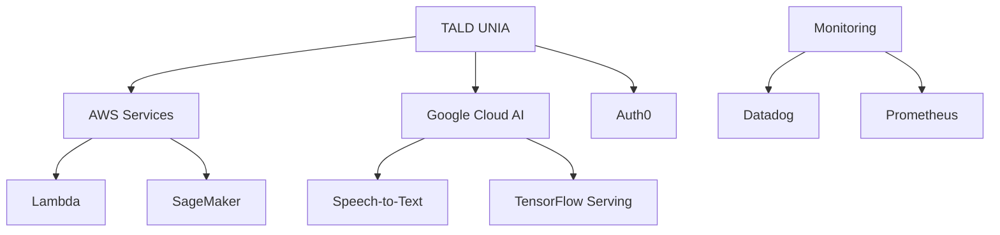
```mermaid
graph TD
    A[TALD UNIA] --> B[AWS Services]
    A --> C[Google Cloud AI]
    A --> D[Auth0]
    
    B --> E[Lambda]
    B --> F[SageMaker]
    
    C --> G[Speech-to-Text]
    C --> H[TensorFlow Serving]
    
    I[Monitoring] --> J[Datadog]
    I --> K[Prometheus]
```

### Service Selection

| Service | Provider | Purpose | SLA |
|---------|----------|---------|-----|
| AI Training | AWS SageMaker | Model training | 99.99% |
| Authentication | Auth0 | User management | 99.99% |
| Speech Services | Google Cloud | Voice processing | 99.9% |
| Monitoring | Datadog | System telemetry | 99.9% |
| CDN | Cloudflare | Edge distribution | 100% |

## 4.5 DEVELOPMENT & DEPLOYMENT

### Development Pipeline

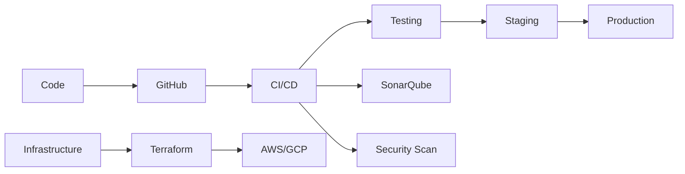
```mermaid
graph LR
    A[Code] --> B[GitHub]
    B --> C[CI/CD]
    C --> D[Testing]
    D --> E[Staging]
    E --> F[Production]
    
    C --> G[SonarQube]
    C --> H[Security Scan]
    
    I[Infrastructure] --> J[Terraform]
    J --> K[AWS/GCP]
```

### Development Tools

| Category | Tool | Version | Purpose |
|----------|------|---------|----------|
| IDE | CLion/VSCode | Latest | Development environment |
| Build System | CMake | 3.26 | Cross-platform builds |
| Containerization | Docker | 24.0 | Application packaging |
| Orchestration | Kubernetes | 1.27 | Container management |
| CI/CD | GitHub Actions | Latest | Automation pipeline |
| IaC | Terraform | 1.5 | Infrastructure management |

### Testing & Quality Tools

| Tool | Purpose | Integration |
|------|----------|------------|
| Catch2 | C++ unit testing | CI pipeline |
| PyTest | Python testing | Pre-commit |
| JMeter | Performance testing | Scheduled |
| SonarQube | Code quality | PR checks |
| Valgrind | Memory analysis | Development |

# 5. SYSTEM DESIGN

## 5.1 Audio Processing Pipeline

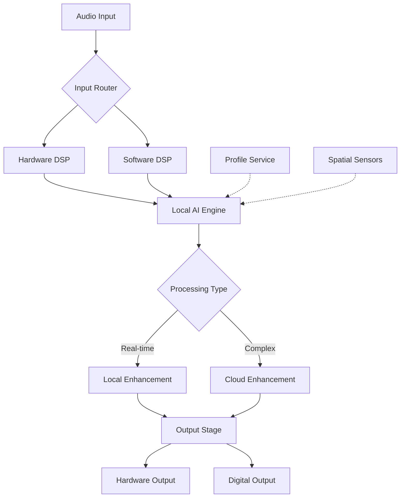
```mermaid
flowchart TD
    A[Audio Input] --> B{Input Router}
    B --> C[Hardware DSP]
    B --> D[Software DSP]
    
    C --> E[Local AI Engine]
    D --> E
    
    E --> F{Processing Type}
    F -->|Real-time| G[Local Enhancement]
    F -->|Complex| H[Cloud Enhancement]
    
    G --> I[Output Stage]
    H --> I
    
    I --> J[Hardware Output]
    I --> K[Digital Output]
    
    L[Profile Service] -.-> E
    M[Spatial Sensors] -.-> E
```

## 5.2 User Interface Design

### 5.2.1 Audio Control Interface

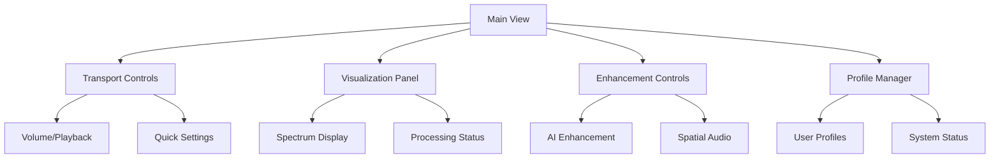
```mermaid
graph TD
    A[Main View] --> B[Transport Controls]
    A --> C[Visualization Panel]
    A --> D[Enhancement Controls]
    A --> E[Profile Manager]
    
    B --> F[Volume/Playback]
    B --> G[Quick Settings]
    
    C --> H[Spectrum Display]
    C --> I[Processing Status]
    
    D --> J[AI Enhancement]
    D --> K[Spatial Audio]
    
    E --> L[User Profiles]
    E --> M[System Status]
```

### 5.2.2 Interface Components

| Component | Purpose | Interaction Model |
|-----------|---------|------------------|
| Transport Bar | Primary audio controls | Touch/gesture/voice |
| Visualization | Real-time audio feedback | Dynamic rendering |
| Enhancement Panel | AI/spatial controls | Slider/toggle controls |
| Profile Manager | User settings | List/grid selection |
| Status Display | System monitoring | Auto-updating metrics |

## 5.3 Database Design

### 5.3.1 Core Schema

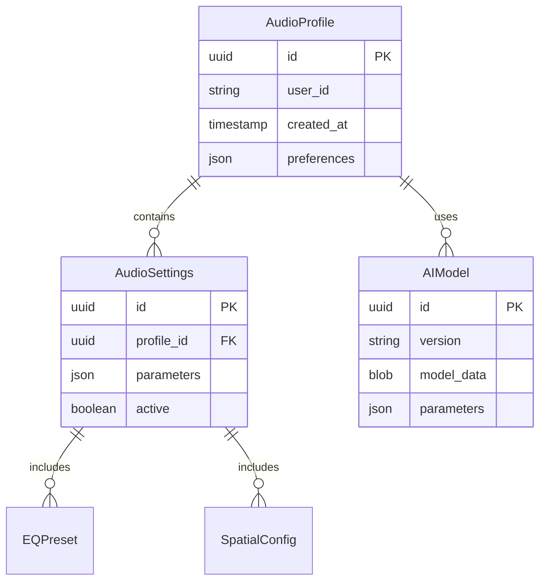
```mermaid
erDiagram
    AudioProfile ||--o{ AudioSettings : contains
    AudioProfile ||--o{ AIModel : uses
    AudioSettings ||--o{ EQPreset : includes
    AudioSettings ||--o{ SpatialConfig : includes
    
    AudioProfile {
        uuid id PK
        string user_id
        timestamp created_at
        json preferences
    }
    
    AudioSettings {
        uuid id PK
        uuid profile_id FK
        json parameters
        boolean active
    }
    
    AIModel {
        uuid id PK
        string version
        blob model_data
        json parameters
    }
```

### 5.3.2 Storage Strategy

| Data Type | Storage Solution | Scaling Strategy |
|-----------|-----------------|------------------|
| User Profiles | PostgreSQL | Vertical partitioning |
| Audio Cache | Redis | Memory/disk hybrid |
| AI Models | Object Storage | CDN distribution |
| Analytics | TimescaleDB | Time-based partitioning |
| Session Data | Redis Cluster | Horizontal scaling |

## 5.4 API Design

### 5.4.1 Core API Structure

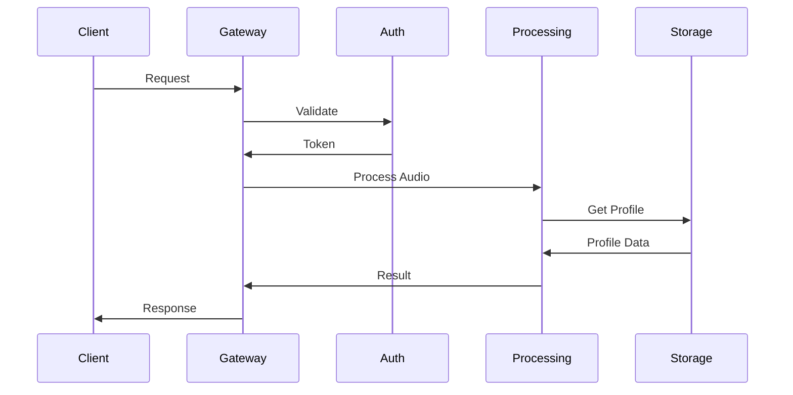
```mermaid
sequenceDiagram
    participant Client
    participant Gateway
    participant Auth
    participant Processing
    participant Storage
    
    Client->>Gateway: Request
    Gateway->>Auth: Validate
    Auth->>Gateway: Token
    Gateway->>Processing: Process Audio
    Processing->>Storage: Get Profile
    Storage->>Processing: Profile Data
    Processing->>Gateway: Result
    Gateway->>Client: Response
```

### 5.4.2 API Endpoints

| Endpoint | Method | Purpose | Authentication |
|----------|--------|---------|----------------|
| /api/v1/audio/process | POST | Real-time processing | JWT |
| /api/v1/profiles | GET/POST | Profile management | OAuth 2.0 |
| /api/v1/settings | PUT | Update settings | JWT |
| /api/v1/models | GET | AI model access | API Key |
| /api/v1/spatial | POST | Spatial processing | JWT |

### 5.4.3 WebSocket Events

| Event | Direction | Purpose |
|-------|-----------|---------|
| audio.stream | Bidirectional | Real-time audio |
| audio.status | Server->Client | Processing status |
| profile.update | Server->Client | Settings sync |
| spatial.track | Client->Server | Position data |
| system.metrics | Server->Client | Performance data |

## 5.5 Processing Architecture

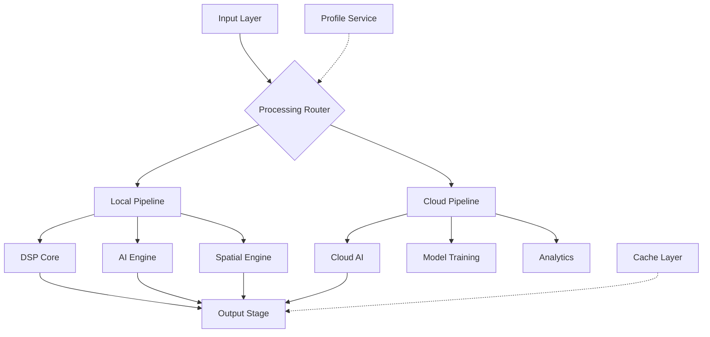
```mermaid
graph TD
    A[Input Layer] --> B{Processing Router}
    B --> C[Local Pipeline]
    B --> D[Cloud Pipeline]
    
    C --> E[DSP Core]
    C --> F[AI Engine]
    C --> G[Spatial Engine]
    
    D --> H[Cloud AI]
    D --> I[Model Training]
    D --> J[Analytics]
    
    E --> K[Output Stage]
    F --> K
    G --> K
    H --> K
    
    L[Profile Service] -.-> B
    M[Cache Layer] -.-> K
```

## 5.6 Security Architecture

| Layer | Security Measure | Implementation |
|-------|-----------------|----------------|
| Network | TLS 1.3 | All external communication |
| Authentication | OAuth 2.0/JWT | API access control |
| Authorization | RBAC | Feature access |
| Data | AES-256 | Storage encryption |
| Processing | Secure enclave | AI model protection |
| Monitoring | ELK Stack | Security analytics |

## 5.7 Scalability Design

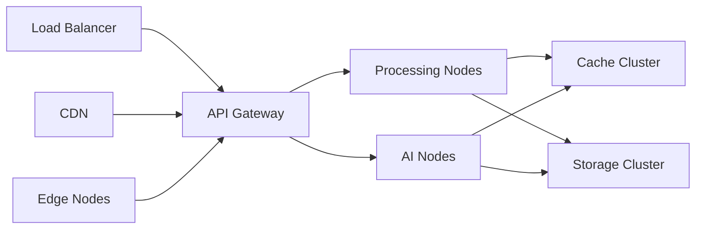
```mermaid
graph LR
    A[Load Balancer] --> B[API Gateway]
    B --> C[Processing Nodes]
    B --> D[AI Nodes]
    
    C --> E[Cache Cluster]
    D --> E
    
    C --> F[Storage Cluster]
    D --> F
    
    G[CDN] --> B
    H[Edge Nodes] --> B
```

# 6. USER INTERFACE DESIGN

## 6.1 Design System

| Element | Specification | Implementation |
|---------|--------------|----------------|
| Typography | SF Pro Display | Variable font scaling |
| Colors | P3 Color Space | Dynamic contrast adaptation |
| Grid | 8px Base Grid | Responsive scaling |
| Spacing | 4/8/16/24/32px | Consistent rhythm |
| Animations | 200-300ms | Reduced motion support |

## 6.2 Main Audio Control Interface

```
+----------------------------------------------------------+
|  TALD UNIA Audio Control                             [x]   |
+----------------------------------------------------------+
|  [@] User Profile     [=] Settings         [?] Help       |
|----------------------------------------------------------|
|                                                           |
|  [#] Dashboard View                                       |
|  +----------------------------------------------------+  |
|  |                    Volume Control                   |  |
|  |  [-]=================[O]======================[+]   |  |
|  |  0dB                                        +12dB   |  |
|  +----------------------------------------------------+  |
|                                                           |
|  +----------------------+  +---------------------------+  |
|  |   Spatial Audio     |  |    AI Enhancement         |  |
|  |  [v] Room Profile   |  |  [*] Dynamic Processing   |  |
|  |  [v] HRTF Setting   |  |  [*] Noise Reduction     |  |
|  |  [ ] Head Tracking  |  |  [ ] Spatial Upsampling   |  |
|  +----------------------+  +---------------------------+  |
|                                                           |
|  +----------------------------------------------------+ |
|  |                 Frequency Response                   | |
|  |    ╭─╮                                              | |
|  |   ╭╯ ╰╮    ╭╮  ╭╮                                  | |
|  |  ╭╯   ╰╮  ╭╯╰╮╭╯╰╮                                | |
|  | ╭╯     ╰╮╭╯  ╰╯  ╰╮                               | |
|  +----------------------------------------------------+ |
|                                                          |
|  [Apply Changes]          [Reset]          [Save Preset] |
+----------------------------------------------------------+
```

### Key:
- `[x]` Close window
- `[@]` User profile access
- `[=]` Settings menu
- `[?]` Help documentation
- `[#]` Dashboard view
- `[-][+]` Volume adjustment
- `[v]` Dropdown menu
- `[ ]` Checkbox toggle
- `[*]` Active feature
- `╭╮╯╰` Frequency response graph

## 6.3 Profile Management Interface

```
+----------------------------------------------------------+
|  Audio Profiles                                      [x]   |
+----------------------------------------------------------+
|  [+] New Profile                    [@] Current: Studio   |
|----------------------------------------------------------|
|  Saved Profiles:                                          |
|  +----------------------------------------------------+  |
|  |  (*) Studio                                        |  |
|  |      Last modified: 2024-01-20                     |  |
|  |      [Load] [Edit] [Delete]                        |  |
|  |                                                    |  |
|  |  ( ) Gaming                                        |  |
|  |      Last modified: 2024-01-19                     |  |
|  |      [Load] [Edit] [Delete]                        |  |
|  |                                                    |  |
|  |  ( ) Movie                                         |  |
|  |      Last modified: 2024-01-18                     |  |
|  |      [Load] [Edit] [Delete]                        |  |
|  +----------------------------------------------------+  |
|                                                          |
|  Profile Settings:                                       |
|  +----------------------------------------------------+ |
|  | [v] Enhancement Level: High                         | |
|  | [v] Room Size: Medium                              | |
|  | [v] HRTF Profile: Custom                           | |
|  | [...] Profile Name                                 | |
|  +----------------------------------------------------+ |
|                                                          |
|  [Save Changes]                     [Export Profile]     |
+----------------------------------------------------------+
```

### Key:
- `[+]` Create new profile
- `(*)` Selected radio button
- `( )` Unselected radio button
- `[...]` Text input field
- `[v]` Dropdown selection
- `[Load]` Action button

## 6.4 Real-time Analysis View

```
+----------------------------------------------------------+
|  Audio Analysis                                      [x]   |
+----------------------------------------------------------+
|  [!] Processing Load: 45%         [i] Buffer: 2ms         |
|----------------------------------------------------------|
|                                                           |
|  Spectrum Analyzer                                        |
|  +----------------------------------------------------+  |
|  |  ║║║                                                |  |
|  |  ║║║║                                               |  |
|  |  ║║║║║                                              |  |
|  |  ║║║║║║                 ║                           |  |
|  |  ║║║║║║║     ║║        ║║                          |  |
|  |  ║║║║║║║║    ║║║       ║║║                         |  |
|  |  20Hz    100Hz    1kHz    10kHz    20kHz          |  |
|  +----------------------------------------------------+  |
|                                                           |
|  Processing Status:                                       |
|  +----------------------------------------------------+  |
|  | AI Enhancement:  [============================] 85%  |  |
|  | Spatial Audio:   [==================]         45%    |  |
|  | Head Tracking:   [======================]     60%    |  |
|  +----------------------------------------------------+  |
|                                                          |
|  [Capture State]        [Reset Analysis]      [Export]   |
+----------------------------------------------------------+
```

### Key:
- `[!]` Warning/alert indicator
- `[i]` Information indicator
- `║` Spectrum bar
- `[====]` Progress bar
- `[Export]` Action button

## 6.5 Settings Interface

```
+----------------------------------------------------------+
|  System Settings                                     [x]   |
+----------------------------------------------------------+
|  [=] General                 [#] Audio              [@]   |
|----------------------------------------------------------|
|                                                           |
|  Audio Processing:                                        |
|  +----------------------------------------------------+  |
|  | [v] Processing Quality:                             |  |
|  |     ○ Maximum Quality (Higher CPU Usage)            |  |
|  |     ● Balanced                                      |  |
|  |     ○ Power Saver                                   |  |
|  |                                                     |  |
|  | [ ] Enable Cloud Processing                         |  |
|  | [x] Local AI Enhancement                           |  |
|  | [ ] Automatic Room Calibration                      |  |
|  +----------------------------------------------------+  |
|                                                           |
|  Hardware Configuration:                                  |
|  +----------------------------------------------------+  |
|  | Output Device: [v] TALD UNIA DAC                   |  |
|  | Buffer Size:   [v] 256 Samples                     |  |
|  | Sample Rate:   [v] 192kHz                          |  |
|  | Bit Depth:     [v] 32-bit Float                    |  |
|  +----------------------------------------------------+  |
|                                                          |
|  [Apply Settings]                    [Restore Defaults]  |
+----------------------------------------------------------+
```

### Key:
- `[v]` Dropdown menu
- `●` Selected radio option
- `○` Unselected radio option
- `[x]` Checked checkbox
- `[ ]` Unchecked checkbox
- `[=]` Settings tab
- `[#]` Audio tab
- `[@]` User tab

## 6.6 Interaction Flows

```mermaid
graph TD
    A[Main Interface] --> B{User Action}
    B -->|Volume Change| C[Update Audio]
    B -->|Profile Select| D[Load Profile]
    B -->|AI Toggle| E[Process Change]
    
    C --> F[Save State]
    D --> F
    E --> F
    
    F --> G[Update UI]
    G --> A
```

## 6.7 Responsive Behavior

| Breakpoint | Layout Adjustment |
|------------|------------------|
| < 768px | Single column, stacked controls |
| 768-1024px | Two column, condensed graphs |
| 1024-1440px | Full layout with sidebars |
| > 1440px | Extended layout with additional metrics |

# 7. SECURITY CONSIDERATIONS

## 7.1 AUTHENTICATION AND AUTHORIZATION

### 7.1.1 Authentication Methods

| Method | Use Case | Implementation |
|--------|----------|----------------|
| OAuth 2.0 | Primary user authentication | Auth0 integration |
| JWT | API access | RS256 signing |
| API Keys | Developer access | Rate-limited, scoped keys |
| Device Certificates | Hardware authentication | X.509 certificates |
| Biometric | Local device access | Secure enclave integration |

### 7.1.2 Authorization Model

```mermaid
graph TD
    A[User Request] --> B{Authentication}
    B -->|Valid| C{Role Check}
    B -->|Invalid| D[Deny Access]
    
    C -->|Authorized| E[Grant Access]
    C -->|Unauthorized| D
    
    E --> F{Permission Level}
    F -->|Admin| G[Full Access]
    F -->|Developer| H[API Access]
    F -->|User| I[Basic Access]
    
    style B fill:#f96,stroke:#333
    style C fill:#f96,stroke:#333
    style F fill:#f96,stroke:#333
```

### 7.1.3 Role-Based Access Control

| Role | Permissions | Access Level |
|------|------------|--------------|
| Admin | Full system access | All features and settings |
| Developer | API access, debugging tools | Limited to API scope |
| Power User | Advanced audio features | Enhanced audio processing |
| Basic User | Standard audio features | Basic audio controls |
| Guest | Limited playback | Temporary access |

## 7.2 DATA SECURITY

### 7.2.1 Encryption Standards

```mermaid
graph LR
    A[Data Types] --> B[At Rest]
    A --> C[In Transit]
    A --> D[In Processing]
    
    B --> E[AES-256-GCM]
    C --> F[TLS 1.3]
    D --> G[Secure Enclave]
    
    E --> H[Hardware Security Module]
    F --> I[Certificate Management]
    G --> J[Memory Encryption]
```

### 7.2.2 Data Protection Measures

| Data Type | Protection Method | Key Management |
|-----------|------------------|----------------|
| Audio Streams | Real-time encryption | Session keys |
| User Profiles | AES-256 encryption | Master key hierarchy |
| AI Models | Secure enclave storage | Hardware-bound keys |
| Analytics Data | Anonymization | Rotating keys |
| Cache Data | Encrypted memory | Ephemeral keys |

### 7.2.3 Secure Storage Architecture

```mermaid
flowchart TD
    A[Data Input] --> B{Classification}
    B --> C[Sensitive Data]
    B --> D[Non-Sensitive Data]
    
    C --> E[Encryption Layer]
    E --> F[Secure Storage]
    
    D --> G[Standard Storage]
    
    F --> H[HSM Backup]
    G --> I[Regular Backup]
```

## 7.3 SECURITY PROTOCOLS

### 7.3.1 Network Security

| Protocol | Purpose | Implementation |
|----------|---------|----------------|
| TLS 1.3 | Secure communication | Perfect forward secrecy |
| IPSec | VPN tunneling | Site-to-site security |
| WPA3 | Wireless security | Enterprise mode |
| DTLS 1.2 | UDP security | Real-time audio protection |
| SNMPv3 | Device monitoring | Encrypted monitoring |

### 7.3.2 Security Monitoring

```mermaid
graph TD
    A[Security Events] --> B[SIEM System]
    B --> C[Real-time Analysis]
    B --> D[Threat Detection]
    
    C --> E[Alert Generation]
    D --> E
    
    E --> F[Security Response]
    E --> G[Audit Logging]
    
    H[Sensors] --> B
    I[System Logs] --> B
```

### 7.3.3 Incident Response

| Phase | Actions | Tools |
|-------|---------|-------|
| Detection | Automated monitoring | ELK Stack, Prometheus |
| Analysis | Event correlation | Splunk, Grafana |
| Containment | Automatic isolation | Network segmentation |
| Eradication | Threat removal | Security automation |
| Recovery | System restoration | Backup systems |
| Documentation | Incident logging | JIRA Security |

### 7.3.4 Compliance Controls

```mermaid
flowchart LR
    A[Compliance Requirements] --> B{Control Types}
    B --> C[Technical Controls]
    B --> D[Administrative Controls]
    B --> E[Physical Controls]
    
    C --> F[Encryption]
    C --> G[Access Control]
    C --> H[Monitoring]
    
    D --> I[Policies]
    D --> J[Training]
    
    E --> K[Hardware Security]
    E --> L[Environmental]
```

### 7.3.5 Security Updates

| Update Type | Frequency | Distribution |
|-------------|-----------|--------------|
| Firmware | Monthly | Staged rollout |
| Security Patches | As needed | Emergency deployment |
| AI Models | Bi-weekly | Verified updates |
| Certificates | Annually | Automated renewal |
| Security Policies | Quarterly | Managed distribution |

# 8. INFRASTRUCTURE

## 8.1 DEPLOYMENT ENVIRONMENT

The TALD UNIA Audio System utilizes a hybrid deployment model combining on-device processing with cloud capabilities:

```mermaid
graph TD
    A[TALD UNIA Device] --> B{Deployment Types}
    B --> C[On-Device]
    B --> D[Edge Computing]
    B --> E[Cloud Services]
    
    C --> F[Core Audio Processing]
    C --> G[Local AI Inference]
    
    D --> H[Regional Edge Nodes]
    D --> I[CDN Audio Cache]
    
    E --> J[Advanced AI Processing]
    E --> K[Profile Management]
    
    style A fill:#f9f,stroke:#333
    style B fill:#bbf,stroke:#333
```

| Environment Type | Components | Purpose |
|-----------------|------------|----------|
| On-Device | Audio Core, DSP Engine, Local AI | Real-time processing |
| Edge Computing | Regional Processors, Cache Nodes | Low-latency features |
| Cloud Infrastructure | AI Training, Profile Storage | Advanced processing |
| Development | CI/CD Pipeline, Testing Environment | Development workflow |

## 8.2 CLOUD SERVICES

### Primary Cloud Provider: AWS

| Service | Purpose | Configuration |
|---------|----------|--------------|
| AWS Lambda | Serverless audio processing | 1024MB memory, 15min timeout |
| Amazon SageMaker | AI model training | ml.p3.2xlarge instances |
| Amazon S3 | Audio sample storage | Standard + Intelligent Tiering |
| Amazon Aurora | Profile database | Multi-AZ deployment |
| Amazon ElastiCache | Real-time caching | Redis cluster mode |
| AWS Direct Connect | Dedicated connectivity | 1Gbps connection |

### Secondary Cloud Provider: Google Cloud

| Service | Purpose | Configuration |
|---------|----------|--------------|
| Cloud TPU | AI acceleration | v4-8 TPU pods |
| Cloud CDN | Audio content delivery | Global edge presence |
| Speech-to-Text | Voice processing | Premium model |
| Cloud Bigtable | Time-series data | SSD storage class |

## 8.3 CONTAINERIZATION

```mermaid
graph LR
    A[Container Registry] --> B{Container Types}
    B --> C[Audio Processing]
    B --> D[AI Services]
    B --> E[API Services]
    
    C --> F[Audio Core Container]
    C --> G[DSP Container]
    
    D --> H[AI Inference Container]
    D --> I[Model Training Container]
    
    E --> J[API Gateway Container]
    E --> K[Profile Service Container]
```

### Container Specifications

| Container | Base Image | Resource Limits |
|-----------|------------|-----------------|
| Audio Core | Ubuntu 22.04 slim | 2 CPU, 4GB RAM |
| DSP Engine | Alpine 3.18 | 4 CPU, 8GB RAM |
| AI Inference | NVIDIA CUDA 12.0 | 1 GPU, 16GB RAM |
| API Gateway | nginx:alpine | 1 CPU, 2GB RAM |
| Profile Service | node:18-alpine | 2 CPU, 4GB RAM |

## 8.4 ORCHESTRATION

Kubernetes-based orchestration system with the following configuration:

```mermaid
graph TD
    A[Kubernetes Cluster] --> B[Control Plane]
    A --> C[Worker Nodes]
    
    B --> D[API Server]
    B --> E[Scheduler]
    B --> F[Controller Manager]
    
    C --> G[Audio Processing Pods]
    C --> H[AI Processing Pods]
    C --> I[Service Pods]
    
    J[Istio Service Mesh] -.-> G
    J -.-> H
    J -.-> I
```

### Cluster Configuration

| Component | Specification | Scaling Policy |
|-----------|--------------|----------------|
| Control Plane | HA configuration | N+1 redundancy |
| Worker Nodes | Auto-scaling groups | CPU utilization >70% |
| GPU Nodes | NVIDIA A100 support | Manual scaling |
| Storage | EBS gp3 volumes | Dynamic provisioning |
| Network | Calico CNI | Network isolation |

## 8.5 CI/CD PIPELINE

```mermaid
graph LR
    A[Source Code] --> B[GitHub Actions]
    B --> C{Build Process}
    C --> D[Unit Tests]
    C --> E[Integration Tests]
    C --> F[Security Scan]
    
    D --> G[Container Build]
    E --> G
    F --> G
    
    G --> H{Deployment}
    H --> I[Development]
    H --> J[Staging]
    H --> K[Production]
    
    L[Quality Gates] -.-> H
```

### Pipeline Stages

| Stage | Tools | SLA |
|-------|-------|-----|
| Code Analysis | SonarQube, CodeQL | <10 minutes |
| Unit Testing | Catch2, PyTest | <15 minutes |
| Integration Testing | JUnit, Postman | <30 minutes |
| Security Scanning | Snyk, Trivy | <20 minutes |
| Container Build | Docker BuildKit | <25 minutes |
| Deployment | ArgoCD | <15 minutes |

### Deployment Environments

| Environment | Update Frequency | Validation |
|-------------|------------------|------------|
| Development | Continuous | Automated tests |
| Staging | Daily | Manual + Automated |
| Production | Weekly | Full test suite |
| Hotfix | As needed | Critical tests |

# 8. APPENDICES

## 8.1 Additional Technical Information

### Audio Processing Pipeline Details

```mermaid
flowchart TD
    A[Audio Input] --> B{Format Detection}
    B --> C[PCM Processing]
    B --> D[Compressed Audio]
    B --> E[Network Stream]
    
    C --> F[DSP Chain]
    D --> G[Decoder]
    E --> H[Buffer]
    
    G --> F
    H --> F
    
    F --> I[AI Enhancement]
    I --> J[Spatial Processing]
    J --> K[Output Stage]
```

### Hardware Integration Matrix

| Component | Interface | Protocol | Buffer Size |
|-----------|-----------|----------|-------------|
| ESS ES9038PRO DAC | I2S | 32-bit | 256 samples |
| XMOS XU316 Controller | USB | UAC2 | 512 samples |
| TI TAS5805M Amplifier | I2C | Custom | 128 samples |
| Cirrus Logic CS35L41 | SPI | Custom | 64 samples |
| MEMS Microphone Array | PDM | 24-bit | 1024 samples |

## 8.2 GLOSSARY

| Term | Definition |
|------|------------|
| Adaptive EQ | Dynamic equalization that adjusts based on audio content and environment |
| Beamforming | Technique using multiple microphones to focus on specific sound directions |
| Class-D Amplification | High-efficiency switching amplifier technology |
| HRTF | Head-Related Transfer Function for 3D audio positioning |
| Neural DSP | Digital Signal Processing using neural networks |
| Object-based Audio | Audio rendering treating sounds as distinct spatial objects |
| Room Correction | Automatic acoustic compensation for room characteristics |
| Zero Latency Monitoring | Direct audio monitoring without processing delay |

## 8.3 ACRONYMS

| Acronym | Full Form |
|---------|-----------|
| ADC | Analog-to-Digital Converter |
| ASIO | Audio Stream Input/Output |
| DAC | Digital-to-Analog Converter |
| DTLS | Datagram Transport Layer Security |
| HRTF | Head-Related Transfer Function |
| I2C | Inter-Integrated Circuit |
| I2S | Integrated Interchip Sound |
| MEMS | Micro-Electro-Mechanical Systems |
| PDM | Pulse-Density Modulation |
| SIMD | Single Instruction Multiple Data |
| SPI | Serial Peripheral Interface |
| THD+N | Total Harmonic Distortion plus Noise |
| UAC2 | USB Audio Class 2.0 |
| VBR | Variable Bit Rate |
| VST | Virtual Studio Technology |
| WSS | WebSocket Secure |

## 8.4 Development Environment Requirements

| Component | Requirement | Version |
|-----------|------------|---------|
| CMake | Build System | ≥3.26 |
| CUDA Toolkit | GPU Development | ≥12.0 |
| GCC/Clang | C++ Compiler | ≥12.0/≥15.0 |
| Python | AI Development | ≥3.11 |
| TensorFlow | AI Framework | ≥2.13 |
| VSCode/CLion | IDE | Latest |
| Docker | Containerization | ≥24.0 |
| Git | Version Control | ≥2.40 |

## 8.5 Performance Benchmarks

```mermaid
graph LR
    A[Performance Metrics] --> B[Audio Quality]
    A --> C[Processing Load]
    A --> D[Power Efficiency]
    
    B --> E[THD+N <0.0005%]
    B --> F[SNR >120dB]
    
    C --> G[CPU <40%]
    C --> H[Memory <1GB]
    
    D --> I[90% Efficiency]
    D --> J[<5W Idle]
```

## 8.6 Compliance Standards Reference

| Standard | Description | Requirement |
|----------|-------------|-------------|
| IEC 60065 | Audio Safety | Mandatory |
| EN 50332 | Volume Limiting | Mandatory |
| ISO/IEC 23008-3 | 3D Audio | Reference |
| ETSI TS 103 224 | Voice Quality | Reference |
| AES67 | Audio over IP | Optional |
| IEEE 1722 | Time-Sensitive Networking | Optional |
| HDCP 2.3 | Content Protection | Mandatory |
| Dolby Atmos | Spatial Audio | Reference |